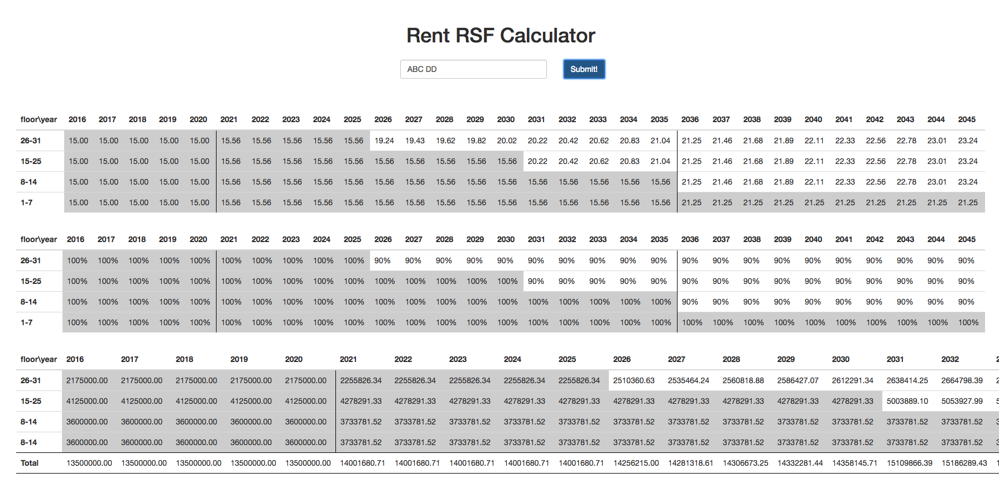

# cornell-real-estate-comp-2016

This program simulates all possibilities that the landlord can rent the building with a combination of contracts. However, I cannot upload the prompt to this directory.

### Instructions

Input is ${ABCD}^{≤5}$ and there can be any space between each character of input. For each input, it will render the amount of rental fee, occupancy rate, and revenue differently based on the provided condition. 

### Image

### Environment

Flask & Python 2.7
